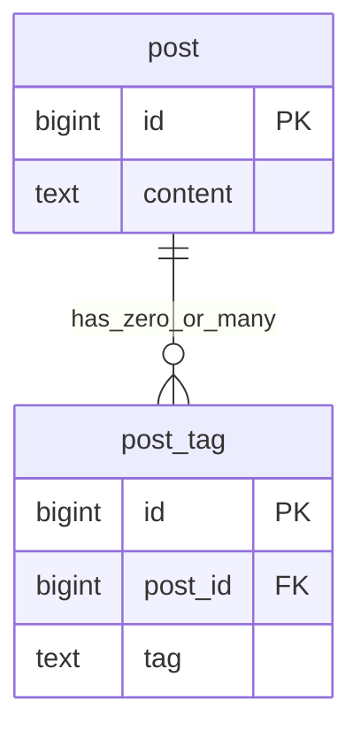
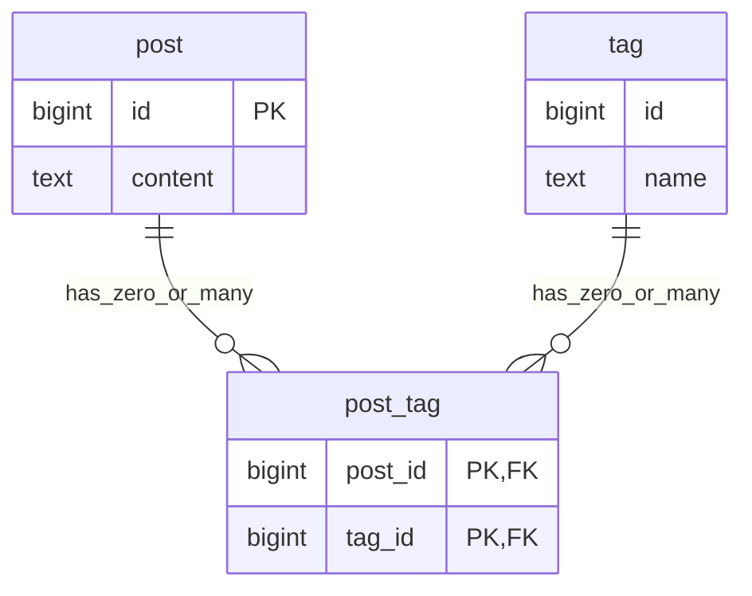
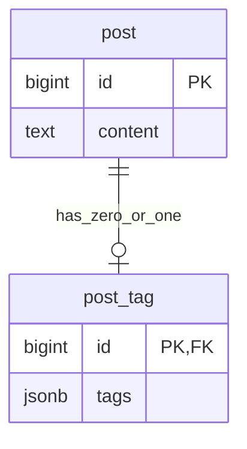
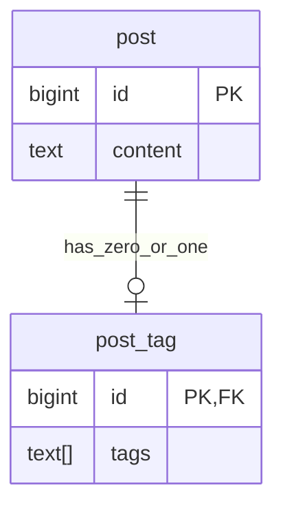

# PostgreSQL Hashtags Analysis
A research and development project to determine the optimal and efficient method for storing hashtags in PostgreSQL.

## Abstract
Using a `JSONB` column with a PostgreSQL `Generalized Inverted Index` was the most optimal and efficient method for storing and querying hashtags.

## Introduction
Hashtags are a way to organize content around a specific topic.

The benefits of hashtags include: 

+ `Discoverability`. When you use a hashtag, your content will show up in search results for that hashtag. This means that people interested in that topic can easily find your content.
+ `Connection`. Hashtags can be used to connect with people who are interested in the same things as you.
+ `Engagement`. Hashtags can be used to track trends on social media. This can be helpful for businesses and brands to see what topics are popular and to get involved in conversations.
+ `Promotion`. Hashtags can be used to promote your content and to get more people to see it. When you use relevant hashtags, your content will show up in search results for those hashtags. This can help you to reach a wider audience.

Hashtags are ubiquitous in modern applications and having an optimal and efficient method for storing and querying hashtags is essential.

## Methods

### PostgreSQL storage configurations

**Denormalized Storage**

+ A `post` has zero or many `post_tag` records
+ A unique index on `(post_id, tag)` within the `post_tag` table
+ An index on `tag` within the `post_tag` table
+ The `tag` value in the `post_tag` table can be redundant

**Normalized Storage**

+ A `post` has zero or many `post_tag` records
+ A `tag` has zero or many `post_tag` records
+ A unique index on `(post_id, tag_id)` within the `post_tag`
  

**JSONB Storage**

+ A `post` has zero or one `post_tag` record
+ A GIN (Generalized Inverted Index) on `tags` within the `post_tag` table

**Array Storage**

+ A `post` has zero or one `post_tag` record

### PostgreSQL testbed
+ Generate 5 million posts
+ Generate 1 million tags
+ for each post, randomly associate _up to_ 10 tags
+ for 5 million posts, randomly associate 3 tags (extremely common tags)
+ for 2,5 million posts, randomly associate 3 tags (very common tags)
+ for 1.25 million posts, randomly associate 3 tags (common tags)
+ A `common` tag is defined as a popular tag
+ A `rare` tag is defined as an unpopular tag

### PostgreSQL queries

**Denormalized Query**
``` sql
    select post_id
    from post_tag
    where tag = '{tag}'
    limit 25 offset 0;
```

**Normalized Query**
``` sql
    select post_id
    from post_tag
    inner join tag on post_tag.tag_id = tag.id
    where tag.name = '{tag}'
    limit 25 offset 0;
```

**JSONB Query**
``` sql
    select post_id
    from post_tag
    where post_tag.tags::jsonb OPERATOR(pg_catalog.@>) '["{tag}"]'::jsonb
    limit 25 offset 0;
```

**Array Query**
``` sql
    select post_id
    from post_tag
    where post_tag.tags::jsonb OPERATOR(pg_catalog.@>) '["{tag}"]'::jsonb
    limit 25 offset 0;
```

## Results

**Number of records**

```mermaid
gantt
  title Number of records - millions
  todayMarker off
  dateFormat  X
  axisFormat %s

  section Denormalized
  36,239,475  : 0, 36
  section Normalized
  36,239,475  : 0, 36
  section JSONB
  5  : 0, 5
  section Array
  5  : 0, 5
```


**Size of tables**

```mermaid
gantt
  title Size of tables - megabytes
  todayMarker off
  dateFormat  X
  axisFormat %s

  section Denormalized
  6,344  : 0, 7
  section Normalized
  2,580  : 0, 3
  section JSONB
  1.744  : 0, 2
  section Array
  1,824  : 0, 2
```


**Query for Most Common Tag (5 million associations)**

```mermaid
gantt
  title Execution time - milliseconds
  todayMarker off
  dateFormat  X
  axisFormat %s

  section Denormalized
  AVG 53  : 0, 53
  MED 48  : 0, 48
  section Normalized
  AVG 4768  : 0, 4800
  MED 4756  : 0, 4800
  section JSONB
  AVG 56  : 0, 56
  MED 51  : 0, 51
  section Array
  AVG 55  : 0, 55
  MED 49  : 0, 49
```


**Query for Second Most Common Tag (2.5 million associations)**


**Query for Third Most Common Tag (1.25 million associations)**


**Query for a Random Tag**

```mermaid
gantt
  title Execution time - milliseconds
  todayMarker off
  dateFormat  X
  axisFormat %s

  section Denormalized
  AVG 70  : 0, 70
  MED 48  : 0, 48
  section Normalized
  AVG 4081  : 0, 4000
  MED 3990  : 0, 4000
  section JSONB
  AVG 50  : 0, 50
  MED 46  : 0, 46
  section Array
  AVG 135  : 0, 135
  MED 127  : 0, 127
```


**Query for the Rarest Tag**

```mermaid
gantt
  title Execution time - milliseconds
  todayMarker off
  dateFormat  X
  axisFormat %s

  section Denormalized
  AVG 60  : 0, 60
  MED 57  : 0, 57
  section Normalized
  AVG 4258  : 0, 4300
  MED 4222  : 0, 4200
  section JSONB
  AVG 63  : 0, 63
  MED 59  : 0, 59
  section Array
  AVG 2090  : 0, 2000
  MED 1942  : 0, 1900
```


## Discussion
+ The `Denormalized` and `JSONB` methods displayed similar performance
+ The `Array` method displayed degradation with rare tag querying
+ The `Normalized` method displayed inefficient querying throughout
+ Based upon storage size and efficient querying costs, the `JSONB` method is the best choice
